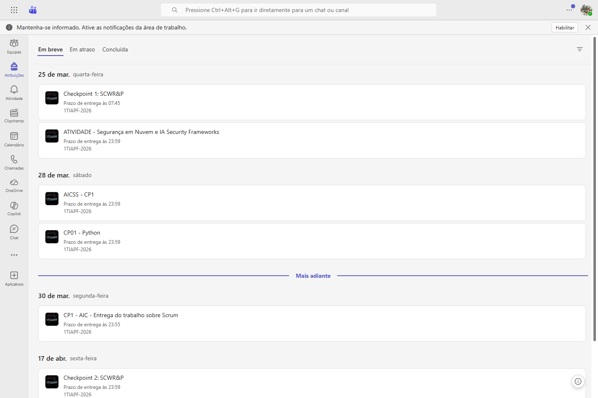
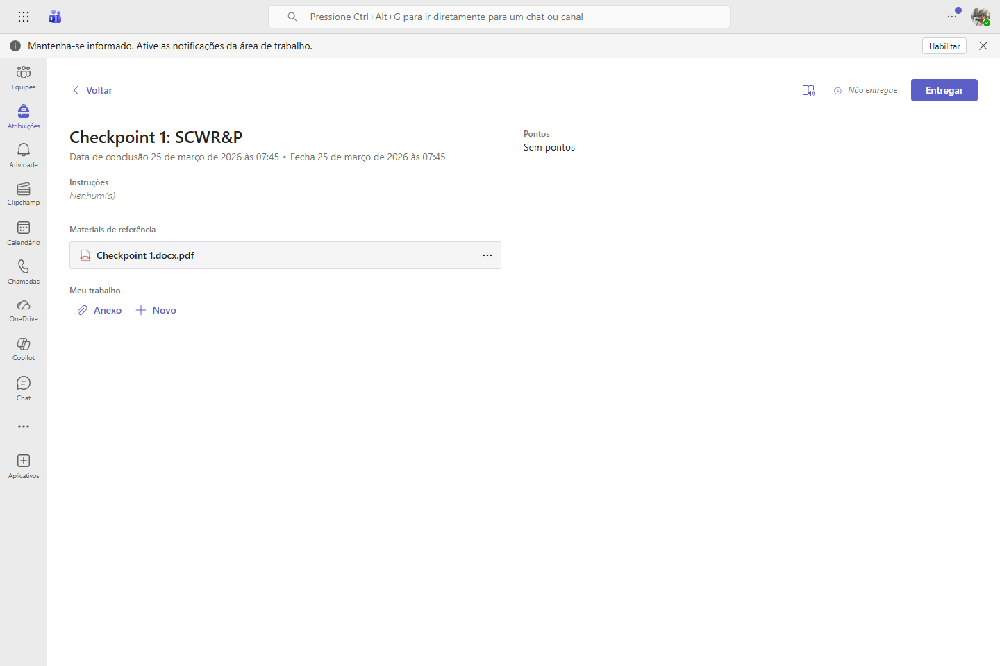
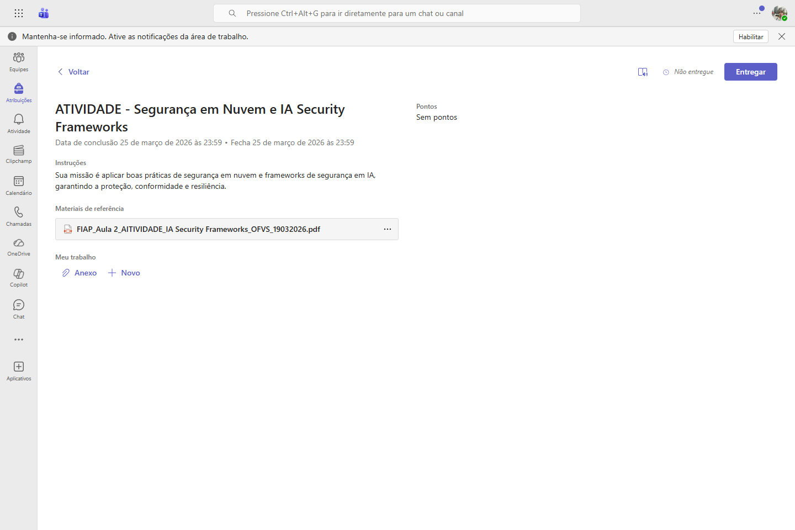

# FIAPAUTO v0.2

FIAPAUTO e um assistente academico focado em transformar atividades extraidas do Microsoft Teams em uma experiencia util para o aluno.

Hoje o projeto ja consegue:
- extrair trabalhos e anexos do Teams
- organizar topicos por materia
- gerar resumo, memoria e aprendizado automatico por atividade
- responder perguntas contextuais com fallback local e suporte a LLM em nuvem
- oferecer uma experiencia separada por modulos de `Aulas`, `Trabalhos` e `Aprendizado`

## Visao do Produto
O objetivo do FIAPAUTO nao e so listar trabalhos. A ideia e entregar um copiloto academico que ajude o aluno a:
- entender rapidamente o que a atividade pede
- saber o que entregar e como comecar
- tirar duvidas frequentes sem ler tudo do zero
- abrir o PDF original em um clique quando quiser validar manualmente

## Estado Atual da v0.2
- Novo motor hibrido para respostas contextuais
- Melhor tratamento de topicos numerados como `item 4`
- UI do aluno mais amigavel
- Nova aba de `Aprendizado` gerada automaticamente por atividade
- Melhor limpeza de resumo, prazo e entregaveis
- Acesso rapido ao PDF principal

## Arquitetura
```text
frontend/
  layout/
  engineweb/
  features/
backend/
  apis/
  automations/
  bots/
  connections/
  engine/
  runtime/        # local, ignorado no Git
utilities/
docs/
```

Workspaces principais:
- `@fiapauto/frontend`
- `@fiapauto/backend`
- `@fiapauto/bots`

## Como rodar
```bash
npm install
npm run dev
```

Comandos principais:
```bash
npm run dev
npm run build
npm run lint
npm run bot:test
npm run bot:worker
```

## Screenshots
### Home / identidade


### Captura do Teams


### Lista de atividade extraida


### Detalhe de atividade e assistente


### Outro exemplo de materia


## Fluxo Atual
1. O bot captura trabalhos e anexos do Teams.
2. O backend cria ou atualiza um `SubjectTopic`.
3. O sistema gera `summary`, `agentMemory` e `learning` automaticamente.
4. O frontend exibe:
   - resumo
   - entregaveis
   - prazo
   - arquivos
   - chat contextual
   - aba de aprendizado

## Seguranca e Proximo Passo Estrutural
Hoje ainda existe divisao de interface entre `usuario` e `admin` no mesmo app. O proximo passo recomendado e separar:
- webapp publico do aluno
- webapp admin privado
- rotas e backend admin protegidos

## Para Onde Estamos Indo
O roadmap imediato do projeto e:
- separar app `admin` e app `user`
- melhorar a qualidade automatica do `Aprendizado`
- limpar ainda mais a memoria persistida por topico
- melhorar extracao de entregaveis e datas em todos os tipos de atividade
- preparar deploy do app publico em nuvem

## Documentacao Relacionada
- [Patch Notes v0.2](patchnotes.md)
- [Plano de inteligencia de atribuicoes](docs/ASSIGNMENTS_INTELLIGENCE_PLAN.md)
- [Modulo do bot](docs/BOT_MODULE.md)
